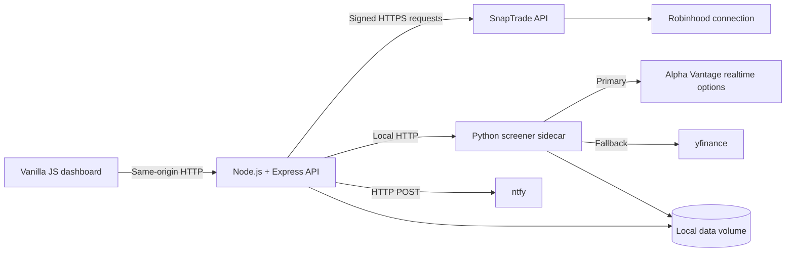

# Wheel Strategy Dashboard

A lightweight, self-hosted dashboard for observing and improving an options wheel strategy. The application is designed for a 64-bit Raspberry Pi and keeps brokerage credentials, normalized trade history, and strategy calculations on infrastructure you control.

Phases 1–4 are implemented locally: the backend stores immutable SnapTrade snapshots, derives a source-linked wheel ledger, screens options through an internal Python sidecar, and delivers deduplicated risk notifications through ntfy. Implementation follows [`PLAN.md`](PLAN.md).

## First-run setup

Wheely Nilly is designed for one person running their own local copy. It has no shared login system and never asks for brokerage credentials directly. SnapTrade handles brokerage authorization; this project stores only API credentials and read-only portfolio snapshots on the machine running it.

Requires Node.js 22 or newer and Python 3.12 or newer. Docker is not required.

```bash
git clone <your-repository-url> wheely-nilly
```
```bash
cd wheely-nilly/backend
npm install
npm run setup
npm run app
```

The setup wizard explains each step, masks secrets while they are entered, verifies the SnapTrade key, opens the path to connect a brokerage, lets the user choose accounts, writes the ignored repository-root `.env` file with mode `0600`, and performs the first portfolio sync. `npm run app` prepares the Python screener on first use and starts both local services. Then open `http://127.0.0.1:3000`; press Ctrl+C in the terminal to stop the app.

## Architecture



### Service boundaries

| Component | Responsibility | Exposure |
| --- | --- | --- |
| `backend` | SnapTrade integration, normalization, local API routes, scheduled jobs, static frontend hosting, and ntfy delivery | Bound to `127.0.0.1:3000` by default |
| `frontend` | Dashboard rendering and local strategy-settings editing with vanilla HTML, CSS, and JavaScript | Served by `backend`; no secrets or direct vendor calls |
| `screener` | Options-chain retrieval and pandas-based calculations | Loopback-only Python service |
| `data` | Raw snapshots, future normalized records, and provider cache | Local bind mount; ignored by Git |

The Node service is the trust boundary. SnapTrade and ntfy credentials must never be placed in frontend code, browser storage, API responses, query strings, images, or logs. The Python service receives only the symbols and strategy parameters it needs; it does not receive SnapTrade credentials.

## Project Layout

```text
.
├── backend/
│   ├── package.json
│   ├── package-lock.json
│   ├── src/
│   │   ├── config/          # Environment validation and runtime configuration
│   │   ├── jobs/            # Scheduled SnapTrade and alert jobs
│   │   ├── routes/          # Express API route modules
│   │   ├── services/        # SnapTrade, persistence, and ntfy adapters
│   │   └── server.js        # Minimal Express entry point
│   └── tests/
├── frontend/
│   ├── assets/
│   │   ├── css/
│   │   │   └── app.css
│   │   └── js/
│   │       └── app.js
│   └── index.html
├── sidecar/
│   ├── app/
│   │   ├── __init__.py
│   │   └── main.py          # Minimal internal FastAPI entry point
│   ├── tests/
│   └── requirements.txt
├── data/                    # Runtime data; contents are never committed
├── docker/
│   ├── backend.Dockerfile
│   └── sidecar.Dockerfile
├── .dockerignore
├── .env.example
├── .gitignore
├── compose.yaml
├── PLAN.md
└── README.md
```

## Security Model

- The dashboard binds to loopback by default. Use an SSH tunnel, VPN, or authenticated TLS reverse proxy for remote access.
- Both containers run as non-root users, use read-only root filesystems, and disable privilege escalation.
- The Python sidecar has no published host port.
- Secrets are read from `.env`, which is ignored by both Git and the Docker build context.
- Logs go to standard output and must use structured redaction. Raw SnapTrade responses must not be logged.
- Runtime records belong under `data/`; that directory is excluded from Git and should be included in encrypted backups.
- Vendor calls must use HTTPS, explicit timeouts, bounded retries with jitter, and rate-limit-aware scheduling.
- The dashboard has no application authentication yet. Do not expose port `3000` directly to the public internet.

## API keys and connection setup

### SnapTrade Personal key

Use a Personal API key for this one-person, self-hosted application:

1. [Create a free SnapTrade Personal account](https://dashboard.snaptrade.com/signup) and verify the email address.
2. Enable two-factor authentication in the SnapTrade Dashboard.
3. Open the [SnapTrade API Key page](https://dashboard.snaptrade.com/api-key) and create a Personal API key.
4. Run `npm run setup` from `backend/` and enter the `clientId` and `consumerKey` when prompted. The consumer key is masked and written only to the local `.env` file.
5. If a brokerage is not already connected, the wizard generates a short-lived SnapTrade Connection Portal URL. Complete the connection there, return to the terminal, and select the accounts to sync.

The Personal key represents the person running this copy. Do not register a separate SnapTrade user, and do not enter Robinhood—or any brokerage—credentials into Wheely Nilly. Brokerage authentication occurs only in SnapTrade's hosted portal. See SnapTrade's [official Personal quickstart](https://docs.snaptrade.com/docs/getting-started#personal-quickstart) for the current upstream process.

### Alpha Vantage key

Request a key from the [official Alpha Vantage key form](https://www.alphavantage.co/support/#api-key), then enter it when the wizard asks or set `ALPHAVANTAGE_API_KEY` in `.env`.

The Screener requests Alpha Vantage's real-time option chain with Greeks and its real-time underlying quote concurrently. Real-time US options are a premium Alpha Vantage function and require the appropriate data entitlement. A free key alone does not guarantee fresher options data. When the key is missing, rate-limited, not entitled, unavailable, or returns an invalid response, the same request automatically falls back to `yfinance` and is visibly marked degraded.

### What each value does

| Variable | Mode | Purpose | Handling rule |
| --- | --- | --- | --- |
| `SNAPTRADE_CLIENT_ID` | Both | Identifies the SnapTrade API key | Keep server-side |
| `SNAPTRADE_CONSUMER_KEY` | Both | Signs API requests | Treat as a high-value secret; rotate if exposed |
| `SNAPTRADE_USER_ID` | Commercial only | Stable application-level identifier for a registered SnapTrade user | Generate once; never recreate on every boot |
| `SNAPTRADE_USER_SECRET` | Commercial only | Authenticates requests for that registered user | Store securely; never send to the browser or log it |
| `SNAPTRADE_BROKERAGE_AUTHORIZATION_ID` | Both | Optional identifier for the discovered Robinhood connection | Set only after Phase 1 account discovery confirms the correct connection |
| `SNAPTRADE_ACCOUNT_IDS` | Both | Brokerage accounts selected by the wizard | Comma-separated; the first sync requires at least one |
| `SCREENER_PROVIDERS` | Optional | Ordered options-provider chain | Defaults to `alphavantage,yfinance` |
| `ALPHAVANTAGE_API_KEY` | Optional | Authenticates the primary options provider | Falls back to `yfinance` when missing or unusable |

### Manual setup

If the wizard cannot run, copy the template and edit it directly:

```bash
cp .env.example .env
chmod 600 .env
```

Set `SNAPTRADE_CLIENT_ID`, `SNAPTRADE_CONSUMER_KEY`, and—after account discovery—`SNAPTRADE_ACCOUNT_IDS`. Leave `SNAPTRADE_USER_ID` and `SNAPTRADE_USER_SECRET` empty for Personal mode. Start the backend, use `GET /api/v1/snaptrade/accounts` to discover IDs, restart after editing `.env`, and call `POST /api/v1/snaptrade/refresh`.

### Advanced Commercial mode

Commercial mode is retained for developers extending the project into a multi-user product, but it is not part of the personal setup wizard. It requires both `SNAPTRADE_USER_ID` and `SNAPTRADE_USER_SECRET` on every account-data call. Never register a new user reactively when authentication fails; that can orphan an existing brokerage connection.

For a new Commercial-mode user, run this once with a stable, non-secret identifier:

```bash
cd backend
npm run register:snaptrade-user -- wheel-dashboard-primary
```

The command writes the returned credentials to `data/private/snaptrade-user.json` with mode `0600` without printing the secret. Copy both values into `.env`, then securely remove that temporary file. Deleting and re-registering a SnapTrade user can sever access to existing brokerage authorizations; do it only as an intentional recovery action after reviewing SnapTrade's current documentation.

### Connection recovery and rate limits

If an existing Robinhood authorization stops syncing, do not register another user. Check `/api/v1/snaptrade/authorizations` and `/api/v1/snaptrade/accounts`, generate a new portal with `POST /api/v1/snaptrade/connection-portal`, and reconnect the existing stable user. Re-pin account IDs only after confirming that SnapTrade issued replacement identifiers.

SnapTrade limits depend on the API mode and current provider policy, so this project does not encode an undocumented requests-per-minute number. It refreshes conservatively every 30 minutes by default, retries only network errors, HTTP 429, and HTTP 5xx responses with bounded jitter, and returns `UPSTREAM_RATE_LIMITED` when the retry budget is exhausted. Increase the schedule frequency only after checking the limits shown for the active SnapTrade application.

### Secret hygiene

- Never commit `.env`; verify with `git status` before every commit.
- Never paste real credentials into issues, screenshots, fixtures, shell history, or chat transcripts.
- Prefer an encrypted password manager for the off-device backup.
- Restrict `.env` to the local account running the app with `chmod 600 .env`.
- Rotate the Consumer Key and user credentials according to SnapTrade's current incident-recovery process if either is exposed.
- Use mock payloads with synthetic account numbers in tests.

## Local Development

### Run everything locally

Requires Node.js 22 or newer and Python 3.12 or newer.

```bash
cd backend
npm install
npm run setup
npm run app
```

The launcher creates `sidecar/.venv`, installs the Python dependencies when needed, and starts both services. Open `http://127.0.0.1:3000`; press Ctrl+C to stop them.

### Run services separately for development

Start the backend with `cd backend && npm run dev`. Express serves `frontend/` and exposes `GET /api/health`.

### Python sidecar

Requires Python 3.12 or newer.

```bash
cd sidecar
python3 -m venv .venv
source .venv/bin/activate
python -m pip install --upgrade pip
python -m pip install -r requirements.txt
uvicorn app.main:app --reload --host 127.0.0.1 --port 8000
```

The sidecar exposes `GET /health` and the internal `POST /v1/screens` contract on loopback only.

## Optional Docker deployment on Raspberry Pi

### Hardware and operating system

- Raspberry Pi 4 or 5 is recommended, with at least 2 GB RAM.
- Use a 64-bit Raspberry Pi OS or another 64-bit Debian-based distribution. The Docker images used here support ARM64.
- Prefer a reliable SSD over an SD card for frequently written runtime data.
- Keep the Pi patched, use SSH keys, disable password SSH where practical, and place it behind a firewall.
- Configure NTP and set `TZ` in `.env`; expiration and alert calculations depend on correct time.

### 1. Install Docker Engine and Compose

Run the official convenience installer on a clean Raspberry Pi OS installation after reviewing the downloaded script:

```bash
sudo apt update
sudo apt install -y ca-certificates curl
curl -fsSL https://get.docker.com -o get-docker.sh
sudo sh get-docker.sh
rm get-docker.sh
sudo usermod -aG docker "$USER"
```

Log out and back in so the group change takes effect, then verify:

```bash
docker version
docker compose version
```

For a production host, Docker's official apt repository is preferable when you need explicit package-version control.

### 2. Deploy the repository

```bash
git clone <your-repository-url> wheel-dashboard
cd wheel-dashboard
```

If Node.js 22 or newer is installed on the Pi, run the guided setup with `cd backend && npm install && npm run setup`. On a Docker-only host, follow the manual setup above. Keep `DASHBOARD_BIND_ADDRESS=127.0.0.1` unless a secured access layer is already in place.

Validate and start the Node service:

```bash
docker compose config
docker compose build backend
docker compose up -d backend
docker compose ps
```

Inspect health and logs:

```bash
curl --fail http://127.0.0.1:3000/api/health
docker compose logs --follow backend
```

The first ARM64 Python image build can take longer because pandas and SciPy are substantial dependencies. In Phase 3, start both services with:

```bash
docker compose --profile screener up -d --build
```

### 3. Access the loopback-bound dashboard

From another computer, open an SSH tunnel:

```bash
ssh -N -L 3000:127.0.0.1:3000 pi@raspberrypi.local
```

Then browse to `http://127.0.0.1:3000` on that computer. This keeps the service off the LAN and internet interfaces.

To make the service available on a trusted LAN, set `DASHBOARD_BIND_ADDRESS=0.0.0.0`. Do this only with host firewall rules and a plan for authentication. For access outside the home network, prefer a private VPN such as WireGuard or Tailscale, or put the service behind an authenticated HTTPS reverse proxy. Do not port-forward the unauthenticated Express service.

### 4. Operate and update

```bash
docker compose pull
docker compose build --pull
docker compose up -d
docker compose ps
docker compose logs --since 30m backend
```

Back up `.env` and `data/` separately using encryption. Stop the services before taking a filesystem-level backup once a database is introduced, or use the database's supported online backup mechanism. Test restoration on another host; an untested backup is not a recovery plan.

## Configuration Reference

| Variable | Phase | Default | Description |
| --- | --- | --- | --- |
| `NODE_ENV` | Scaffold | `production` | Node runtime mode |
| `TZ` | Scaffold | `UTC` | IANA timezone for jobs and displayed timestamps |
| `BACKEND_PORT` | Scaffold | `3000` | Host port mapped to Express |
| `SERVER_HOST` | Scaffold | `127.0.0.1` | Express listen address; Compose overrides it to `0.0.0.0` inside the container |
| `DASHBOARD_BIND_ADDRESS` | Scaffold | `127.0.0.1` | Host interface used by the published port |
| `CORS_ORIGIN` | Scaffold | Empty | Optional comma-separated origins for split frontend development |
| `SNAPTRADE_CLIENT_ID` | 1 | None | SnapTrade application identifier |
| `SNAPTRADE_CONSUMER_KEY` | 1 | None | SnapTrade application signing secret |
| `SNAPTRADE_USER_ID` | 1 | None | Stable local SnapTrade user identifier |
| `SNAPTRADE_USER_SECRET` | 1 | None | Secret returned by SnapTrade user registration |
| `SNAPTRADE_BROKERAGE_AUTHORIZATION_ID` | 1 | Empty | Discovered Robinhood connection identifier |
| `SNAPTRADE_ACCOUNT_IDS` | 1 | Empty | Comma-separated SnapTrade account IDs to ingest; required before refresh runs |
| `INGEST_ENABLED` | 1 | `true` | Enables the scheduled ingestion job |
| `INGEST_CRON` | 1 | `*/30 * * * *` | Cron expression for scheduled ingestion (in `TZ`) |
| `INGEST_ORDERS_DAYS` | 1 | `90` | Lookback window for orders (SnapTrade caps at 90) |
| `INGEST_STALE_AFTER_MINUTES` | 1 | `60` | Age after which the status endpoint marks persisted data stale |
| `SNAPTRADE_TIMEOUT_MS` | 1 | `20000` | Per-request upstream timeout |
| `RETRY_ATTEMPTS` | 1 | `3` | Retries for transient (429/5xx/network) failures |
| `RETRY_BASE_MS` | 1 | `500` | Base delay for exponential backoff with jitter |
| `DATA_DIR` | 1 | `./data` | Root for raw snapshots and future normalized data |
| `PYTHON_SIDECAR_URL` | 3 | `http://127.0.0.1:8000` | Sidecar URL for direct local runs; Compose overrides it with `http://screener:8000` |
| `SCREENER_PROVIDERS` | 3 | `alphavantage,yfinance` | Ordered market-data providers; first successful snapshot wins |
| `ALPHAVANTAGE_API_KEY` | 3 | Empty | Primary provider key; real-time options require an eligible premium entitlement |
| `NTFY_BASE_URL` | 4 | `https://ntfy.sh` | Hosted or self-hosted ntfy base URL |
| `NTFY_TOPIC` | 4 | Empty | Private, hard-to-guess topic name |
| `NTFY_TOKEN` | 4 | Empty | Optional ntfy access token |
| `NTFY_DRY_RUN` | 4 | `true` | Records notifications without sending them |
| `ALERTS_ENABLED` | 4 | `false` | Enables lifecycle and screener alert enqueueing |
| `ALERT_EXPIRATION_DTE` | 4 | `7,3,1,0` | Comma-separated expiration reminder thresholds |
| `ALERT_ASSIGNMENT_MAX_DTE` | 4 | `7` | Maximum DTE for assignment-risk estimates |
| `ALERT_MIN_ANNUALIZED_RETURN` | 4 | `0.20` | Minimum screener annualized return (decimal) |

## Current Endpoints

| Method | Path | Purpose |
| --- | --- | --- |
| `GET` | `/api/health` | Node container health check |
| `GET` | `/api/v1/snaptrade/status` | Auth mode, scheduler state, configured account IDs, last ingest report |
| `GET` | `/api/v1/snaptrade/accounts` | Discovered accounts with masked numbers (use to pin `SNAPTRADE_ACCOUNT_IDS`) |
| `GET` | `/api/v1/snaptrade/authorizations` | Sanitized brokerage authorization discovery |
| `POST` | `/api/v1/snaptrade/connection-portal` | Generate a short-lived connection/reconnection portal URL |
| `POST` | `/api/v1/snaptrade/refresh` | Manual ingest run; `409` until account IDs are pinned; `207` on partial failure |
| `GET` | `/api/v1/snaptrade/snapshots` | Snapshot index (`?accountId=&endpoint=&limit=`) |
| `GET` | `/api/v1/snaptrade/snapshots/raw?path=` | Raw snapshot envelope by relative path (traversal-safe) |
| `GET` | `/api/v1/wheel/summary` | Versioned premium, cycle, position, review, and freshness summary |
| `GET` | `/api/v1/wheel/cycles` | Wheel cycles; filters: `symbol`, `accountId`, `state`, `from`, `to`, `limit` |
| `GET` | `/api/v1/wheel/positions` | Latest normalized broker positions |
| `GET` | `/api/v1/wheel/premiums` | Source-linked option premium ledger |
| `GET` | `/api/v1/wheel/review` | Unsupported or ambiguous source events |
| `GET` | `screener:8000/health` | Internal Python container health check |
| `POST` | `/api/v1/screens` | Validate and proxy an informational options screen |
| `GET` | `/api/v1/notifications/status` | ntfy configuration, dry-run, rules, and outbox counts |
| `GET` | `/api/v1/notifications/audit` | Redacted local notification audit trail |
| `PATCH` | `/api/v1/notifications/rules` | Enable or disable each alert rule |
| `POST` | `/api/v1/notifications/test` | Enqueue and attempt a credential-free test notification |
| `POST` | `/api/v1/notifications/flush` | Process due outbox entries |
| `GET` | `/api/v1/strategy-settings` | Load saved monitoring rules or deterministic built-in defaults |
| `PUT` | `/api/v1/strategy-settings` | Validate and atomically replace the complete strategy settings document |
| `GET` | `/api/v1/strategy-settings/effective` | Resolve global → goal → ticker rules for a symbol and strategy leg |

### Phase 3 screener

Start the app with `cd backend && npm run app`, then use the Screener tab. Alpha Vantage is queried first for a real-time option chain, provider Greeks, and a real-time underlying quote. Those two Alpha Vantage requests run concurrently. If either request fails, is rate-limited, lacks entitlement, or returns unusable data, the sidecar fetches a complete `yfinance` snapshot instead. Fallback snapshots are labeled unofficial and degraded; they remain visible but do not produce screener alerts. The 120-second cache applies to whichever provider succeeds, limiting duplicate upstream calls.

Candidate premiums assume a 100-share multiplier and midpoint execution only for spreads within the configured limit. The default absolute-delta ceiling is 0.35, puts must be at or out of the money, and calls must be at or above both spot and any supplied adjusted basis. Put return uses strike collateral less net premium; covered-call output reports adjusted-basis and market-value yields separately. Greeks are provider values when present, otherwise Black–Scholes estimates using the response's timestamp and assumptions. Yahoo data is unofficial and may be delayed or unavailable.

### Opportunity-monitoring settings foundation

The Settings tab edits persistent global rules, goal presets, and ticker playbooks. These settings are not wired into Home or Screener yet. See [Strategy Settings v1](docs/strategy-settings.md) for inheritance, fields, starter presets, persistence, and API contracts.

### Phase 4 notifications

Create a private ntfy topic, subscribe your device, set `NTFY_TOPIC` and optionally `NTFY_TOKEN`, then leave `NTFY_DRY_RUN=true` while testing from the Alerts tab. When the audit looks correct, set `NTFY_DRY_RUN=false` and `ALERTS_ENABLED=true`. Notification state is atomically persisted at `data/notifications/state.json`; event fingerprints survive restarts, transient failures remain in the outbox, and authentication/validation failures are not retried indefinitely. Messages omit account IDs and portfolio totals.

Raw endpoints stay loopback-bound and must gain application authentication before any broader network exposure. Raw payloads are never logged; account numbers are masked in API responses.

### Phase 1 quickstart

```bash
cd backend
npm run check:snaptrade          # verifies auth + lists your accounts
curl -s localhost:3000/api/v1/snaptrade/accounts | jq
# pin the intended IDs in .env, then:
curl -s -X POST localhost:3000/api/v1/snaptrade/refresh | jq
curl -s localhost:3000/api/v1/snaptrade/snapshots | jq
```

Snapshots land in `data/raw/accounts/<accountId>/<endpoint>/` as immutable, globally hash-deduplicated JSON envelopes (mode `0600`). Envelopes identify SnapTrade as the source, retain SDK/schema versions and fetch duration, and include the provider freshness timestamp when the payload supplies one. Activity pagination is fully collected before a snapshot is written.

### Phase 2 dashboard

Open `http://127.0.0.1:3000` after starting the backend. The home dashboard shows booked option profit, collateral-weighted and annualized returns, wheel capital, live CSP/CC counts, actionable uncovered-lot opportunities, open trades, calculation coverage, and source freshness. Trades are grouped into searchable ticker cards with summary KPIs and expandable open/closed contract history; screening, holdings, the source-linked premium ledger, and alerts remain available through four compact navigation destinations. The layout is keyboard accessible and stays in a centered, mobile-width column on desktop.

The normalized schema, accounting conventions, idempotency keys, and migration approach are documented in [`docs/normalized-schema.md`](docs/normalized-schema.md). Derived endpoints use `Cache-Control: private, no-store` and include a calculation version and source freshness.

## Data and Calculation Guardrails

- Retain immutable raw snapshots alongside normalized records so calculations can be reproduced after parser changes.
- Store all timestamps in UTC and render them in the configured timezone.
- Use decimal-safe monetary handling; do not rely on binary floating-point for accounting totals.
- Preserve provider/source identifiers to make ingestion idempotent and prevent duplicate premiums.
- Model rolls as a close and a new open contract rather than mutating the original trade.
- Include contract multipliers and fees in premium and basis calculations.
- Label delayed or unofficial market data clearly. `yfinance` is convenient but is not an execution-grade or guaranteed data source.
- Treat all calculated Greeks, yields, and assignment indicators as estimates, not trading instructions.

## Roadmap

Development gates, deliverables, tests, and acceptance criteria are in [`PLAN.md`](PLAN.md). Phases are intentionally sequential so raw brokerage data is validated before strategy accounting, screening, or alerts depend on it.

## Disclaimer

This project is for personal recordkeeping and analysis. It is not financial, tax, legal, or investment advice. Brokerage and market-data APIs can be delayed, incomplete, or unavailable; always verify positions and orders in the broker's official application before making a trading decision.
