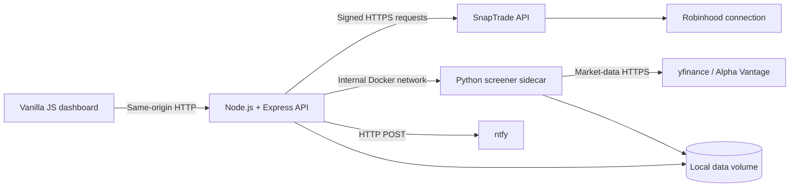

# Wheel Strategy Dashboard

A lightweight, self-hosted dashboard for observing and improving an options wheel strategy. The application is designed for a 64-bit Raspberry Pi and keeps brokerage credentials, normalized trade history, and strategy calculations on infrastructure you control.

Phase 1 is implemented locally: the backend authenticates with SnapTrade, discovers explicitly selected accounts, and stores immutable raw balances, positions, orders, and activity snapshots. The frontend remains a placeholder; lifecycle calculations and portfolio visualization begin in Phase 2. Implementation proceeds in the order defined in [`PLAN.md`](PLAN.md).

## Architecture



### Service boundaries

| Component | Responsibility | Exposure |
| --- | --- | --- |
| `backend` | SnapTrade integration, normalization, local API routes, scheduled jobs, static frontend hosting, and ntfy delivery | Bound to `127.0.0.1:3000` by default |
| `frontend` | Read-only dashboard rendering with vanilla HTML, CSS, and JavaScript | Served by `backend`; no secrets or direct vendor calls |
| `screener` | Options-chain retrieval and pandas-based calculations | Internal Docker network only; opt-in Compose profile |
| `data` | Raw snapshots, future normalized records, and provider cache | Local bind mount; ignored by Git |

The Node service is the trust boundary. SnapTrade and ntfy credentials must never be placed in frontend code, browser storage, API responses, query strings, images, or logs. The Python service receives only the symbols and strategy parameters it needs; it does not receive SnapTrade credentials.

## Project Layout

```text
.
├── backend/
│   ├── package.json
│   ├── package-lock.json
│   ├── src/
│   │   ├── config/          # Environment validation and runtime configuration
│   │   ├── jobs/            # Scheduled SnapTrade and alert jobs
│   │   ├── routes/          # Express API route modules
│   │   ├── services/        # SnapTrade, persistence, and ntfy adapters
│   │   └── server.js        # Minimal Express entry point
│   └── tests/
├── frontend/
│   ├── assets/
│   │   ├── css/
│   │   │   └── app.css
│   │   └── js/
│   │       └── app.js
│   └── index.html
├── sidecar/
│   ├── app/
│   │   ├── __init__.py
│   │   └── main.py          # Minimal internal FastAPI entry point
│   ├── tests/
│   └── requirements.txt
├── data/                    # Runtime data; contents are never committed
├── docker/
│   ├── backend.Dockerfile
│   └── sidecar.Dockerfile
├── .dockerignore
├── .env.example
├── .gitignore
├── compose.yaml
├── PLAN.md
└── README.md
```

## Security Model

- The dashboard binds to loopback by default. Use an SSH tunnel, VPN, or authenticated TLS reverse proxy for remote access.
- Both containers run as non-root users, use read-only root filesystems, and disable privilege escalation.
- The Python sidecar has no published host port.
- Secrets are read from `.env`, which is ignored by both Git and the Docker build context.
- Logs go to standard output and must use structured redaction. Raw SnapTrade responses must not be logged.
- Runtime records belong under `data/`; that directory is excluded from Git and should be included in encrypted backups.
- Vendor calls must use HTTPS, explicit timeouts, bounded retries with jitter, and rate-limit-aware scheduling.
- The dashboard has no application authentication yet. Do not expose port `3000` directly to the public internet.

## SnapTrade Credentials

### 1. Create the local environment file

From the repository root:

```bash
cp .env.example .env
chmod 600 .env
```

Populate these values in `.env` (Personal API key mode, recommended for this self-hosted dashboard):

```dotenv
SNAPTRADE_CLIENT_ID=your_personal_client_id
SNAPTRADE_CONSUMER_KEY=your_personal_consumer_key
```

SnapTrade supports two SDK authentication modes. In **Personal API key** mode your key identifies your own SnapTrade account: do not register users, and omit `userId`/`userSecret` from account-data calls. **Commercial API key** mode is for apps managing many end users and additionally requires `SNAPTRADE_USER_ID` and `SNAPTRADE_USER_SECRET`. This project defaults to Personal mode; leave the two user variables empty unless you deliberately migrate to Commercial.

### 2. Understand each value

| Variable | Mode | Purpose | Handling rule |
| --- | --- | --- | --- |
| `SNAPTRADE_CLIENT_ID` | Both | Identifies the SnapTrade application | Keep server-side even if it is not treated as the primary signing secret |
| `SNAPTRADE_CONSUMER_KEY` | Both | Signs/authenticates application requests | Treat as a high-value secret; rotate if exposed |
| `SNAPTRADE_USER_ID` | Commercial only | Stable application-level identifier for a registered SnapTrade user | Generate once; never recreate on every boot |
| `SNAPTRADE_USER_SECRET` | Commercial only | Authenticates requests for that registered user | Store securely; never send to the browser or log it |
| `SNAPTRADE_BROKERAGE_AUTHORIZATION_ID` | Both | Optional identifier for the discovered Robinhood connection | Set only after Phase 1 account discovery confirms the correct connection |

The `User ID` and `User Secret` are SnapTrade user credentials, not Robinhood login credentials. Robinhood authentication takes place through SnapTrade's connection portal. This application must never collect or store a Robinhood username, password, MFA seed, or session cookie.

### 3. Connection lifecycle

Phase 1 implements this flow deliberately rather than on every application start:

1. Initialize the official SDK with the matching auth helper (`SnaptradeAuth.personalApiKey(...)` for this project).
2. Generate a short-lived SnapTrade connection portal URL.
3. Complete Robinhood authorization in the SnapTrade-hosted flow.
4. Discover brokerage authorizations and accounts, then record the intended Robinhood authorization ID.
5. Fetch holdings and options data server-side using the configured auth mode.

Commercial-mode apps additionally register a user first and pass its credentials on every account-data call. Never register a new user reactively when authentication fails; that can orphan an existing brokerage connection and complicate diagnosis.

For a new Commercial-mode user, run this once with a stable, non-secret identifier:

```bash
cd backend
npm run register:snaptrade-user -- wheel-dashboard-primary
```

The command writes the returned credentials to `data/private/snaptrade-user.json` with mode `0600` without printing the secret. Copy both values into `.env`, then securely remove that temporary file. Deleting and re-registering a SnapTrade user can sever access to existing brokerage authorizations; do it only as an intentional recovery action after reviewing SnapTrade's current documentation.

### 4. Connection recovery and rate limits

If an existing Robinhood authorization stops syncing, do not register another user. Check `/api/v1/snaptrade/authorizations` and `/api/v1/snaptrade/accounts`, generate a new portal with `POST /api/v1/snaptrade/connection-portal`, and reconnect the existing stable user. Re-pin account IDs only after confirming that SnapTrade issued replacement identifiers.

SnapTrade limits depend on the API mode and current provider policy, so this project does not encode an undocumented requests-per-minute number. It refreshes conservatively every 30 minutes by default, retries only network errors, HTTP 429, and HTTP 5xx responses with bounded jitter, and returns `UPSTREAM_RATE_LIMITED` when the retry budget is exhausted. Increase the schedule frequency only after checking the limits shown for the active SnapTrade application.

### 4. Secret hygiene

- Never commit `.env`; verify with `git status` before every commit.
- Never paste real credentials into issues, screenshots, fixtures, shell history, or chat transcripts.
- Prefer an encrypted password manager for the off-device backup.
- Restrict `.env` to the account running Docker with `chmod 600 .env`.
- Rotate the Consumer Key and user credentials according to SnapTrade's current incident-recovery process if either is exposed.
- Use mock payloads with synthetic account numbers in tests.

## Local Development

### Backend and frontend

Requires Node.js 22 or newer.

```bash
cp .env.example .env
cd backend
npm install
npm run dev
```

Open `http://127.0.0.1:3000`. Express serves `frontend/` and exposes `GET /api/health`.

### Python sidecar

Requires Python 3.12 or newer.

```bash
cd sidecar
python3 -m venv .venv
source .venv/bin/activate
python -m pip install --upgrade pip
python -m pip install -r requirements.txt
uvicorn app.main:app --reload --host 127.0.0.1 --port 8000
```

The current sidecar exposes only `GET /health`. Options-chain routes are deferred to Phase 3.

## Raspberry Pi Deployment

### Hardware and operating system

- Raspberry Pi 4 or 5 is recommended, with at least 2 GB RAM.
- Use a 64-bit Raspberry Pi OS or another 64-bit Debian-based distribution. The Docker images used here support ARM64.
- Prefer a reliable SSD over an SD card for frequently written runtime data.
- Keep the Pi patched, use SSH keys, disable password SSH where practical, and place it behind a firewall.
- Configure NTP and set `TZ` in `.env`; expiration and alert calculations depend on correct time.

### 1. Install Docker Engine and Compose

Run the official convenience installer on a clean Raspberry Pi OS installation after reviewing the downloaded script:

```bash
sudo apt update
sudo apt install -y ca-certificates curl
curl -fsSL https://get.docker.com -o get-docker.sh
sudo sh get-docker.sh
rm get-docker.sh
sudo usermod -aG docker "$USER"
```

Log out and back in so the group change takes effect, then verify:

```bash
docker version
docker compose version
```

For a production host, Docker's official apt repository is preferable when you need explicit package-version control.

### 2. Deploy the repository

```bash
git clone <your-repository-url> wheel-dashboard
cd wheel-dashboard
cp .env.example .env
chmod 600 .env
```

Edit `.env` locally on the Pi and provide the two Personal-mode SnapTrade variables, or all four user/application variables for Commercial mode. Keep `DASHBOARD_BIND_ADDRESS=127.0.0.1` unless a secured access layer is already in place.

Validate and start the Node service:

```bash
docker compose config
docker compose build backend
docker compose up -d backend
docker compose ps
```

Inspect health and logs:

```bash
curl --fail http://127.0.0.1:3000/api/health
docker compose logs --follow backend
```

The first ARM64 Python image build can take longer because pandas and SciPy are substantial dependencies. In Phase 3, start both services with:

```bash
docker compose --profile screener up -d --build
```

### 3. Access the loopback-bound dashboard

From another computer, open an SSH tunnel:

```bash
ssh -N -L 3000:127.0.0.1:3000 pi@raspberrypi.local
```

Then browse to `http://127.0.0.1:3000` on that computer. This keeps the service off the LAN and internet interfaces.

To make the service available on a trusted LAN, set `DASHBOARD_BIND_ADDRESS=0.0.0.0`. Do this only with host firewall rules and a plan for authentication. For access outside the home network, prefer a private VPN such as WireGuard or Tailscale, or put the service behind an authenticated HTTPS reverse proxy. Do not port-forward the unauthenticated Express service.

### 4. Operate and update

```bash
docker compose pull
docker compose build --pull
docker compose up -d
docker compose ps
docker compose logs --since 30m backend
```

Back up `.env` and `data/` separately using encryption. Stop the services before taking a filesystem-level backup once a database is introduced, or use the database's supported online backup mechanism. Test restoration on another host; an untested backup is not a recovery plan.

## Configuration Reference

| Variable | Phase | Default | Description |
| --- | --- | --- | --- |
| `NODE_ENV` | Scaffold | `production` | Node runtime mode |
| `TZ` | Scaffold | `UTC` | IANA timezone for jobs and displayed timestamps |
| `BACKEND_PORT` | Scaffold | `3000` | Host port mapped to Express |
| `SERVER_HOST` | Scaffold | `127.0.0.1` | Express listen address; Compose overrides it to `0.0.0.0` inside the container |
| `DASHBOARD_BIND_ADDRESS` | Scaffold | `127.0.0.1` | Host interface used by the published port |
| `CORS_ORIGIN` | Scaffold | Empty | Optional comma-separated origins for split frontend development |
| `SNAPTRADE_CLIENT_ID` | 1 | None | SnapTrade application identifier |
| `SNAPTRADE_CONSUMER_KEY` | 1 | None | SnapTrade application signing secret |
| `SNAPTRADE_USER_ID` | 1 | None | Stable local SnapTrade user identifier |
| `SNAPTRADE_USER_SECRET` | 1 | None | Secret returned by SnapTrade user registration |
| `SNAPTRADE_BROKERAGE_AUTHORIZATION_ID` | 1 | Empty | Discovered Robinhood connection identifier |
| `SNAPTRADE_ACCOUNT_IDS` | 1 | Empty | Comma-separated SnapTrade account IDs to ingest; required before refresh runs |
| `INGEST_ENABLED` | 1 | `true` | Enables the scheduled ingestion job |
| `INGEST_CRON` | 1 | `*/30 * * * *` | Cron expression for scheduled ingestion (in `TZ`) |
| `INGEST_ACTIVITIES_DAYS` | 1 | `90` | Lookback window for account activities |
| `INGEST_ORDERS_DAYS` | 1 | `90` | Lookback window for orders (SnapTrade caps at 90) |
| `INGEST_STALE_AFTER_MINUTES` | 1 | `60` | Age after which the status endpoint marks persisted data stale |
| `SNAPTRADE_TIMEOUT_MS` | 1 | `20000` | Per-request upstream timeout |
| `RETRY_ATTEMPTS` | 1 | `3` | Retries for transient (429/5xx/network) failures |
| `RETRY_BASE_MS` | 1 | `500` | Base delay for exponential backoff with jitter |
| `DATA_DIR` | 1 | `./data` | Root for raw snapshots and future normalized data |
| `PYTHON_SIDECAR_URL` | 3 | `http://screener:8000` | Internal sidecar base URL |
| `SCREENER_PROVIDER` | 3 | `yfinance` | Selected market-data adapter |
| `ALPHAVANTAGE_API_KEY` | 3 | Empty | Optional Alpha Vantage credential |
| `NTFY_BASE_URL` | 4 | `https://ntfy.sh` | Hosted or self-hosted ntfy base URL |
| `NTFY_TOPIC` | 4 | Empty | Private, hard-to-guess topic name |
| `NTFY_TOKEN` | 4 | Empty | Optional ntfy access token |

## Current Endpoints

| Method | Path | Purpose |
| --- | --- | --- |
| `GET` | `/api/health` | Node container health check |
| `GET` | `/api/v1/snaptrade/status` | Auth mode, scheduler state, configured account IDs, last ingest report |
| `GET` | `/api/v1/snaptrade/accounts` | Discovered accounts with masked numbers (use to pin `SNAPTRADE_ACCOUNT_IDS`) |
| `GET` | `/api/v1/snaptrade/authorizations` | Sanitized brokerage authorization discovery |
| `POST` | `/api/v1/snaptrade/connection-portal` | Generate a short-lived connection/reconnection portal URL |
| `POST` | `/api/v1/snaptrade/refresh` | Manual ingest run; `409` until account IDs are pinned; `207` on partial failure |
| `GET` | `/api/v1/snaptrade/snapshots` | Snapshot index (`?accountId=&endpoint=&limit=`) |
| `GET` | `/api/v1/snaptrade/snapshots/raw?path=` | Raw snapshot envelope by relative path (traversal-safe) |
| `GET` | `screener:8000/health` | Internal Python container health check |

Raw endpoints stay loopback-bound and must gain application authentication before any broader network exposure. Raw payloads are never logged; account numbers are masked in API responses.

### Phase 1 quickstart

```bash
cd backend
npm run check:snaptrade          # verifies auth + lists your accounts
curl -s localhost:3000/api/v1/snaptrade/accounts | jq
# pin the intended IDs in .env, then:
curl -s -X POST localhost:3000/api/v1/snaptrade/refresh | jq
curl -s localhost:3000/api/v1/snaptrade/snapshots | jq
```

Snapshots land in `data/raw/accounts/<accountId>/<endpoint>/` as immutable, globally hash-deduplicated JSON envelopes (mode `0600`). Envelopes identify SnapTrade as the source, retain SDK/schema versions and fetch duration, and include the provider freshness timestamp when the payload supplies one. Activity pagination is fully collected before a snapshot is written.

## Data and Calculation Guardrails

- Retain immutable raw snapshots alongside normalized records so calculations can be reproduced after parser changes.
- Store all timestamps in UTC and render them in the configured timezone.
- Use decimal-safe monetary handling; do not rely on binary floating-point for accounting totals.
- Preserve provider/source identifiers to make ingestion idempotent and prevent duplicate premiums.
- Model rolls as a close and a new open contract rather than mutating the original trade.
- Include contract multipliers and fees in premium and basis calculations.
- Label delayed or unofficial market data clearly. `yfinance` is convenient but is not an execution-grade or guaranteed data source.
- Treat all calculated Greeks, yields, and assignment indicators as estimates, not trading instructions.

## Roadmap

Development gates, deliverables, tests, and acceptance criteria are in [`PLAN.md`](PLAN.md). Phases are intentionally sequential so raw brokerage data is validated before strategy accounting, screening, or alerts depend on it.

## Disclaimer

This project is for personal recordkeeping and analysis. It is not financial, tax, legal, or investment advice. Brokerage and market-data APIs can be delayed, incomplete, or unavailable; always verify positions and orders in the broker's official application before making a trading decision.
