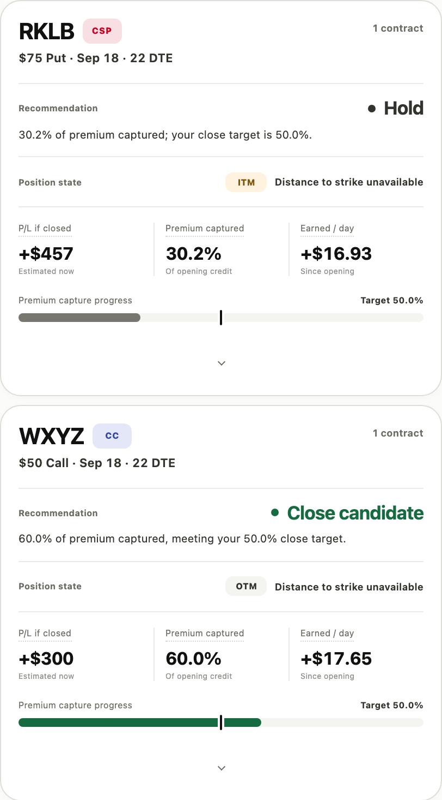

# Wheely Nilly

Wheely Nilly is a local-first workspace for managing the options wheel. It reads brokerage positions through SnapTrade, checks market data through Yahoo Finance, and applies your rules to open contracts and possible next trades.

[Open the live app](https://wheely-nilly.vercel.app) | [View the license](LICENSE.md)

> Wheely Nilly provides analysis only. It cannot place trades and is not investment advice. Market data may be delayed, so confirm prices and contracts with your broker.



## What it helps with

The wheel strategy usually starts with a cash-secured put. If assignment leaves you owning the shares, the next leg is a covered call. Wheely Nilly keeps the positions, rules, and results for that cycle in one place.

- See open contracts, goal-aware roll review, and broker-ready replacement targets when a position needs attention.
- Track booked wheel profit and loss by month and ticker.
- Scan covered calls and cash-secured puts with Radar.
- Save different goals and rules for each ticker and strategy leg.
- Review account balances, positions, and trade history through a read-only brokerage connection.
- Install the site as a progressive web app and reopen its saved view offline.

The current brokerage flow has been tested with Robinhood through SnapTrade. Other brokerages supported by SnapTrade may work, but have not been verified yet.

## Privacy model

Wheely Nilly has no app account, portfolio database, Redis instance, or permanent server storage. Portfolio snapshots, settings, watchlists, and Radar results stay in IndexedDB in your browser.

SnapTrade tokens live in encrypted, authenticated, HttpOnly cookies on the user's device. The connection uses read-only access, OAuth with PKCE, state validation, and rotating refresh tokens. Wheely Nilly never receives brokerage credentials and cannot place, change, or cancel an order.

Closing the app stops all refresh activity. Settings includes an **Erase saved financial data** action for clearing the browser's local copy.

## How it works

```text
Browser
├── Vite frontend and installable PWA
│   ├── IndexedDB for local state
│   ├── cached application shell
│   └── market and brokerage refresh coordinator
└── Vercel API functions
    ├── TypeScript SnapTrade Personal MCP OAuth and brokerage bridge
    └── Python Yahoo Finance market-data bridge
```

The app renders its cached shell and local data first. Market and brokerage refreshes then run independently. Market data refreshes every 2 minutes while the app is visible. Brokerage data refreshes every 30 minutes while visible.

The earlier Raspberry Pi server remains in `backend/` as a migration reference and local fallback. Vercel does not run its filesystem snapshots, scheduled jobs, notification outbox, Docker files, or process launcher.

## Run it locally

You need:

- Node.js 22
- Python 3.12 or newer
- A free SnapTrade Personal account to test a brokerage connection
- The Vercel CLI, which `npx` can run without a global install

Clone the repository and install the frontend dependencies:

```bash
git clone https://github.com/asadhusain97/wheely_nilly.git
cd wheely_nilly
npm install
```

Create the local environment file:

```bash
cp .env.example .env.local
node -e "console.log(require('crypto').randomBytes(32).toString('base64url'))"
```

Paste the generated value into `SESSION_SEAL_KEY` in `.env.local`. Keep `APP_ORIGIN=http://127.0.0.1:3000`. Environment files are ignored by git except for `.env.example`.

Start the complete frontend and API project:

```bash
npx vercel dev --listen 3000
```

Open <http://127.0.0.1:3000>. SnapTrade dynamically registers this exact callback when a connection begins:

```text
http://127.0.0.1:3000/api/auth/callback
```

No SnapTrade developer account, API key, OAuth client ID, or OAuth client secret is required. Each user connects through a free SnapTrade Personal account.

For frontend-only work that does not need the API functions, run:

```bash
npm run dev
```

## Tests and checks

The JavaScript and TypeScript checks run after `npm install`:

```bash
npm run typecheck
npm run build
npm test
npm --prefix backend test
```

Set up the Python test environment once:

```bash
python3 -m venv sidecar/.venv
sidecar/.venv/bin/pip install -r sidecar/requirements.txt
PYTHONPATH=sidecar sidecar/.venv/bin/pytest -q sidecar/tests
```

After that environment exists, `npm run test:all` runs all JavaScript and Python tests.

## Deploy to Vercel

Import the repository into Vercel and leave the project root at the repository root. `vercel.json` runs the Vite build, publishes `dist/`, and deploys the TypeScript and Python functions under `/api`.

Add these production environment variables:

| Name | Value |
| --- | --- |
| `APP_ORIGIN` | Your canonical production origin, without a trailing slash |
| `SESSION_SEAL_KEY` | One generated 32-byte base64url key |
| `MARKET_TIMEOUT_SECONDS` | `15` |

Keep the same `SESSION_SEAL_KEY` across deployments. Changing it signs every user out, but does not delete their browser data. Do not prefix secrets with `VITE_`, because Vite exposes those values to the browser bundle.

After deployment, verify the homepage, `/app`, the SnapTrade return flow, the service worker, and an offline reopen after one successful online load.

## Repository map

| Path | Purpose |
| --- | --- |
| `frontend/` | Vite app, PWA shell, styles, browser storage, and UI tests |
| `api/` | Vercel OAuth, brokerage, and market-data functions |
| `sidecar/` | Python market-data and options-screening code |
| `backend/` | Retained Node server, scheduled jobs, snapshots, and tests |
| `docs/` | Strategy settings, position management, schema, and Radar details |
| `docker/`, `deploy/` | Legacy self-hosting files |
| `vercel.json` | Production routes, function limits, and response headers |

## License

Wheely Nilly is source-available under the [PolyForm Noncommercial License 1.0.0](LICENSE.md).

You may inspect, clone, fork, modify, and redistribute it for permitted noncommercial purposes. You may not sell it or use it for a commercial purpose without a separate license from the maintainer.

This is not an OSI-approved open source license because it restricts commercial use and resale. Calling the code "source-available" is the accurate description. See [NOTICE](NOTICE) for the required copyright notice.
